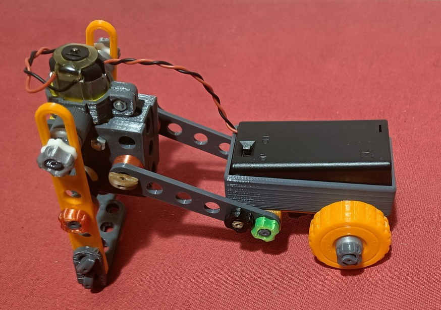

# Automats-Stemfie
Es tracta construir autòmats amb impressió 3D amb format Stemfie. 

Realitzat per [Jordi Mayné](https://github.com/maynej) des de Mechatronic Study jordi.mayne@mechatronicstudy.com 

L'objectiu es augmentar el nombre de models STEMFIE. STEMFIE es un projecte de construcció lliure, que s'imprimeix en 3D (http://stemfie.org) 

La documentació en llengua castellana en PDF es pot trobar en (https://github.com/maynej/Automats-Stemfie/tree/main/DOC_ESP) 

## Propostes 
  
Descripció         | Imatge          | Arxiu PDF    
------------- | ------------- | ------------- 
Caminador amb carretò | | [Caminador Amb Carretò](DOC_CAT/Caminador Amb Carretò_CAT.pdf) 
Grill | | [Grill](DOC_CAT/Gril_Stemfie_CAT.pdf) 

## Llicència

Creative Commons Attribution-NoComercial-ShareAlike 4.0 International (CC BY-NC-SA 4.0)  

## QR

 <a href="https://www.codigos-qr.com/en/qr-code-generator/" target="_blank" id"qrgenerator">Qr Code Generator</a>

